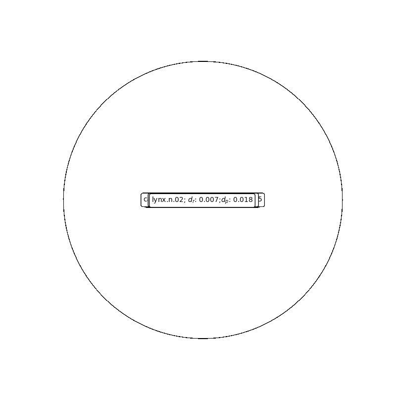
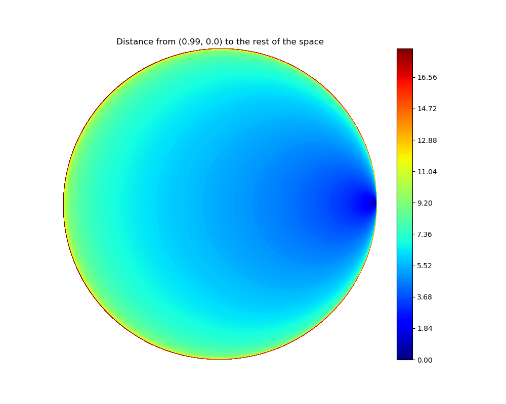
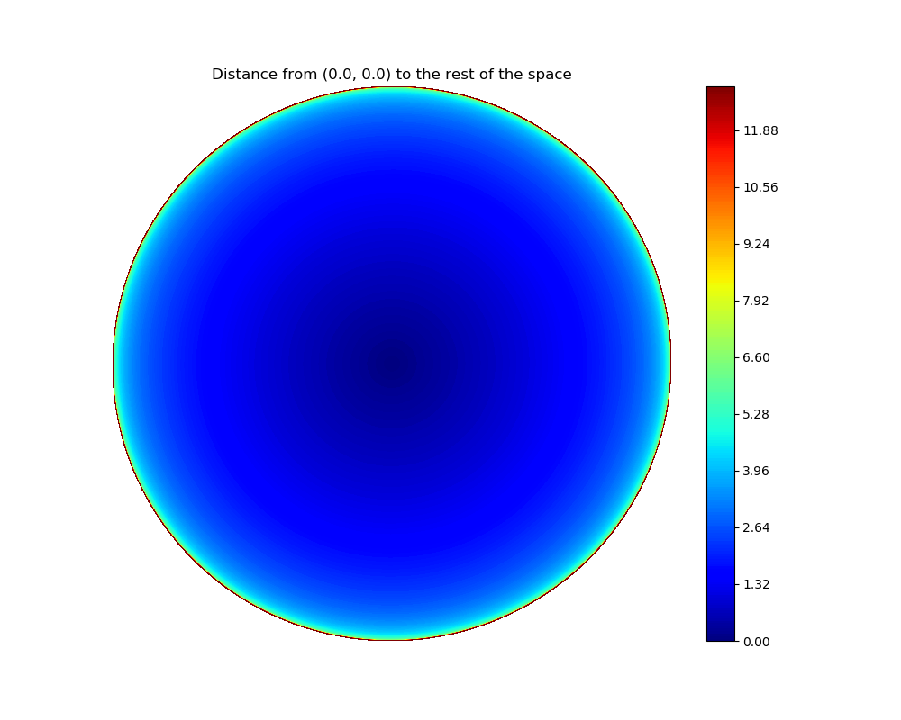

# Implementation of Lorentz Embeddings

This repository provides an implemenation of Lorentz embeddings as described in "[Learning Continuous Hierarchies in the Lorentz Model of Hyperbolic Geometry](https://arxiv.org/abs/1806.03417)" (Nickel and Kiela, 2018). Note that this is not their official implementation but an attempt to recreate and visualize the results presented in the paper.

## Requirements
- Python 3.5
- PyTorch 0.4

## Tasks to Complete
- [x] Implement the basic model
- [x] Get model to converge on WordNet mammals
- [x] Visualize results in Poincaré space
- [x] Train the model on WordNet noun hierarchy
- [ ] Obtain same mAP/MR on WordNet nouns (currently 8.97 MR and 0.7315 mAP with d == 5)
- [ ] Obtain same mAP/MR on WordNet verbs
- [ ] Obtain same mAP/MR on EuroVoc Data
- [ ] Obtain same mAP/MR on ACM data
- [ ] Obtain same mAP/MR on MeSH data

## Visualization
Training visualization of 3D Lorentz embeddings trained on Wordnet mammals projected into the 2D Poincaré disk.

These heatmaps show how the distance between points scales as a point approaches the edge of the manifold.

